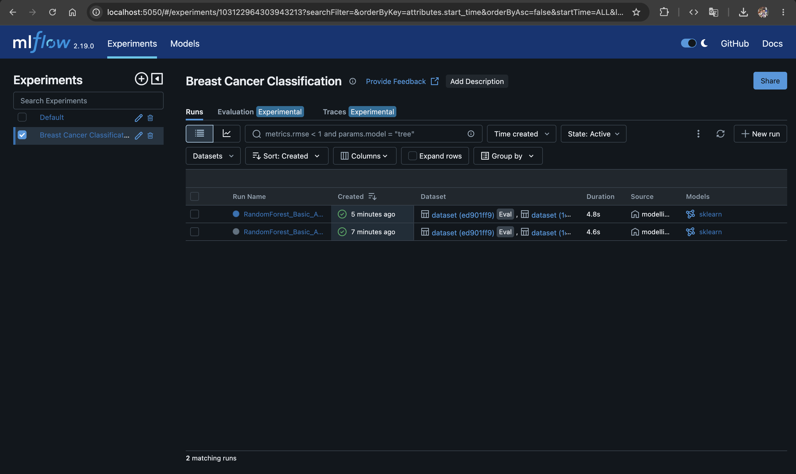
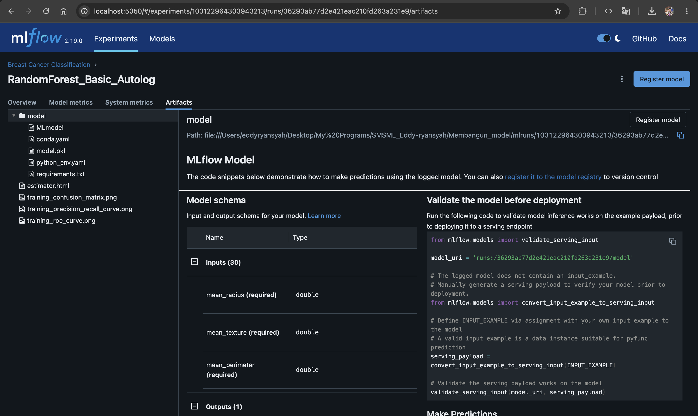
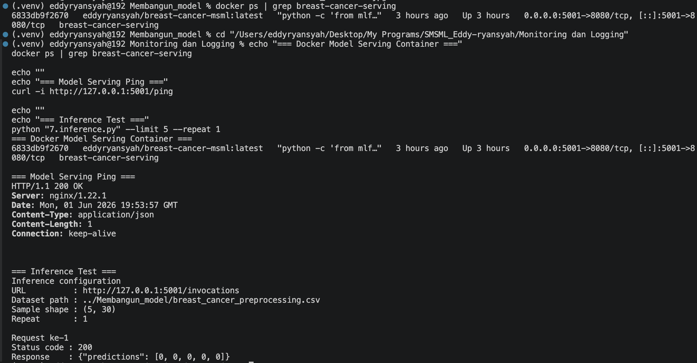
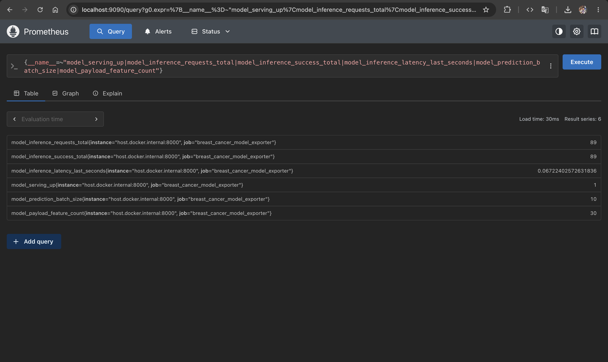
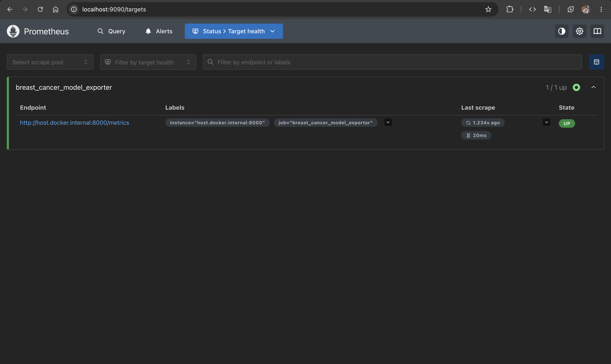
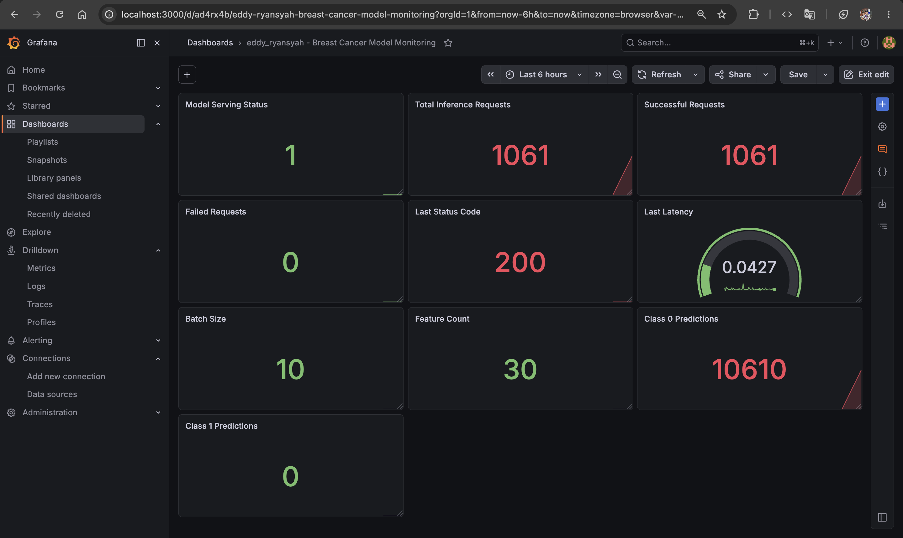
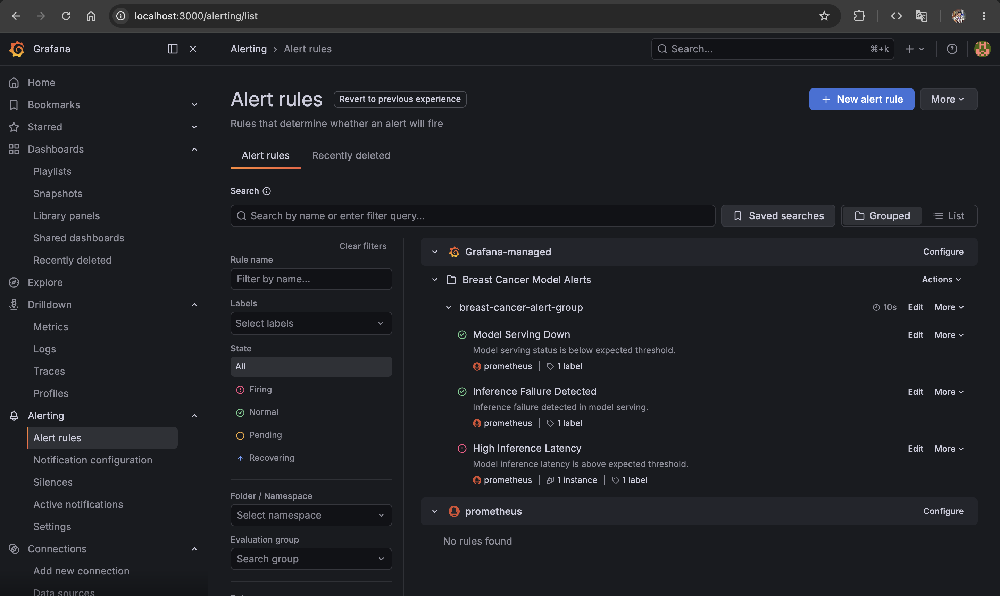

# Breast Cancer MLOps Pipeline

[](https://github.com/eddyryansyah/breast-cancer-mlops-pipeline/actions/workflows/main.yml)
[](https://www.python.org/)
[](https://mlflow.org/)
[](https://www.docker.com/)
[](LICENSE)

An end-to-end Machine Learning Operations (MLOps) project for breast cancer awareness and tumor classification. This project combines a public-facing health awareness concept with a machine learning pipeline built using the Breast Cancer Wisconsin Diagnostic dataset.

The project demonstrates data preprocessing, model training, MLflow experiment tracking, CI/CD automation with GitHub Actions, Docker-based model serving, and monitoring with Prometheus and Grafana.

## Purpose

This project is designed with two goals:

1. **Public awareness:** help users understand that certain breast changes may require medical consultation.
2. **Machine learning demonstration:** classify numerical tumor feature samples as benign or malignant using a trained machine learning model.

The live demo includes a simple awareness section for users and a machine learning prediction section based on sample numerical tumor data.

## Important Note

This project does not provide a medical diagnosis.

The awareness section is intended to encourage early consultation when users notice unusual breast changes. The machine learning model does not analyze personal symptoms directly. It classifies numerical tumor feature samples from the Breast Cancer Wisconsin Diagnostic dataset.

If users notice unusual breast changes, they should consult a qualified healthcare professional.

## Project Links

| Resource                  | Link                                                                |
| ------------------------- | ------------------------------------------------------------------- |
| GitHub Repository         | https://github.com/eddyryansyah/breast-cancer-mlops-pipeline        |
| Docker Hub Image          | https://hub.docker.com/r/eddyryansyah/breast-cancer-mlops-pipeline  |
| DagsHub / MLflow Tracking | https://dagshub.com/eddyryansyah/breast-cancer-mlops-pipeline       |
| Live Demo                 | https://huggingface.co/spaces/eddyryansyah/breast-cancer-mlops-demo |

## Project Overview

This repository contains an end-to-end MLOps workflow for breast cancer tumor classification.

The machine learning component predicts whether a tumor sample is benign or malignant based on numerical cell nucleus features. These features are not symptom inputs. They are structured numerical measurements from the dataset.

The public-facing demo has two parts:

1. **Symptom awareness guidance**
   - Users answer simple awareness questions about unusual breast changes.
   - The system provides a non-diagnostic recommendation to seek medical consultation if concerning signs are selected.

2. **ML classification demo**
   - Users select a sample record from the dataset.
   - The model predicts whether the selected sample is benign or malignant.
   - The demo displays prediction confidence and explains that the model works on numerical tumor features, not personal symptoms.

## MLOps Workflow

```text
Raw Dataset
    ↓
Preprocessing Pipeline
    ↓
Processed Dataset
    ↓
Model Training
    ↓
MLflow Experiment Tracking
    ↓
GitHub Actions CI/CD
    ↓
Docker Image Build
    ↓
Model Serving
    ↓
Prometheus + Grafana Monitoring
    ↓
Hugging Face Public Demo
```

## Tech Stack

- Python 3.12.7
- pandas
- NumPy
- scikit-learn
- MLflow
- GitHub Actions
- Docker
- Prometheus
- Grafana
- Hugging Face Spaces

## Project Structure

```text
.
├── .github/
│   └── workflows/              # GitHub Actions CI/CD workflow
├── app/                        # Hugging Face Gradio demo application
├── data/
│   ├── raw/                    # Original dataset
│   └── processed/              # Preprocessed dataset
├── docs/
│   └── images/                 # MLflow and monitoring evidence
├── mlproject/                  # MLflow Project for automated training
├── monitoring/                 # Prometheus and Grafana monitoring setup
├── preprocessing/              # Data preprocessing notebook and script
├── training/                   # Model training and tuning scripts
├── .python-version             # Python version configuration
├── LICENSE
└── README.md
```

## Dataset

This project uses the [Breast Cancer Wisconsin Diagnostic dataset](https://scikit-learn.org/stable/modules/generated/sklearn.datasets.load_breast_cancer.html), accessed through scikit-learn's `load_breast_cancer` utility.

The dataset is originally available from the [UCI Machine Learning Repository](https://archive.ics.uci.edu/dataset/17/breast%2Bcancer%2Bwisconsin%2Bdiagnostic).

The dataset contains numerical measurements computed from digitized images of breast mass samples and is used to classify tumor samples as either malignant or benign.

The dataset is stored in this repository in two forms:

| Dataset           | Path                                             |
| ----------------- | ------------------------------------------------ |
| Raw dataset       | `data/raw/breast_cancer_raw.csv`                 |
| Processed dataset | `data/processed/breast_cancer_preprocessing.csv` |

The preprocessing workflow is available in:

```text
preprocessing/
├── automate_preprocessing.py
└── preprocessing.ipynb
```

## Awareness Concept

The live demo includes a breast health awareness section.

This section is not a diagnostic tool. It is designed to encourage users to seek medical consultation when they notice unusual breast changes, such as:

- A lump or swelling around the breast, chest, or armpit
- Changes in breast skin, such as dimpling or redness
- Changes in breast size or shape
- Nipple discharge outside pregnancy or breastfeeding
- Changes in nipple shape or appearance
- Breast or armpit pain that does not go away

The output of this section should be written as guidance, for example:

```text
Some selected signs may require medical attention. Please consider consulting a qualified healthcare professional for proper examination.
```

It should not be written as:

```text
You have breast cancer.
```

or:

```text
Your cancer probability is 90%.
```

## Machine Learning Model

The machine learning model uses a Random Forest classifier wrapped in a scikit-learn pipeline.

The model input is not symptom data. It uses numerical tumor features from the dataset.

The training pipeline includes:

- Train-test split with stratification
- Standard scaling
- Random Forest classification
- Metric evaluation
- MLflow parameter logging
- MLflow metric logging
- MLflow model artifact logging

Current validation metrics:

| Metric    |  Score |
| --------- | -----: |
| Accuracy  | 0.9561 |
| Precision | 0.9589 |
| Recall    | 0.9722 |
| F1-score  | 0.9655 |

## Running the MLflow Project Locally

Install dependencies:

```bash
python -m pip install -r mlproject/requirements.txt
```

Run the MLflow Project:

```bash
python -m mlflow run mlproject --env-manager=local
```

The MLflow Project reads the processed dataset from:

```text
data/processed/breast_cancer_preprocessing.csv
```

## MLflow Tracking

MLflow is used to track:

- Model parameters
- Evaluation metrics
- Model artifacts
- Input example
- Model signature

The remote MLflow tracking project is available through the following DagsHub repository:

```text
https://dagshub.com/eddyryansyah/breast-cancer-mlops-pipeline
```

MLflow evidence screenshots are available in:

```text
docs/images/mlflow/
```

### MLflow Dashboard



### MLflow Artifacts



## CI/CD Pipeline

The CI/CD workflow is defined in:

```text
.github/workflows/main.yml
```

The workflow performs the following steps:

1. Checks out the repository.
2. Sets up Python 3.12.7.
3. Installs MLflow project dependencies.
4. Runs the MLflow Project.
5. Finds the logged MLflow model artifact.
6. Uploads MLflow artifacts.
7. Builds a Docker image using MLflow.
8. Pushes the Docker image to Docker Hub on non-pull-request events.

This ensures the project can be trained and packaged automatically through GitHub Actions.

## Docker Image

The model serving image is published to Docker Hub:

```text
eddyryansyah/breast-cancer-mlops-pipeline
```

Docker Hub:

```text
https://hub.docker.com/r/eddyryansyah/breast-cancer-mlops-pipeline
```

The image is produced through the GitHub Actions workflow using MLflow Docker build.

## Monitoring

The monitoring setup is available in:

```text
monitoring/
```

It includes:

| File                     | Purpose                                                |
| ------------------------ | ------------------------------------------------------ |
| `prometheus_exporter.py` | Exposes custom model serving metrics                   |
| `prometheus.yml`         | Defines Prometheus scrape configuration                |
| `docker-compose.yml`     | Runs Prometheus and Grafana locally                    |
| `inference.py`           | Sends inference requests to the model serving endpoint |

The monitoring workflow tracks model serving behavior such as:

- Model serving availability
- Inference request count
- Successful inference count
- Failed inference count
- Last inference latency
- Prediction batch size
- Payload feature count
- Prediction class distribution

## Monitoring Evidence

Monitoring evidence screenshots are available in:

```text
docs/images/monitoring/
```

### Docker Model Serving



### Prometheus Metrics



### Prometheus Targets



### Grafana Dashboard



### Grafana Alert Rules



## Live Demo

The live demo is available on Hugging Face Spaces:

```text
https://huggingface.co/spaces/eddyryansyah/breast-cancer-mlops-demo
```

Demo sections:

### 1. Breast Health Awareness

Users answer simple awareness questions about unusual breast changes. The system gives non-diagnostic guidance to consult a healthcare professional if concerning signs are selected.

### 2. ML Classification Demo

Users select sample tumor records from the dataset. The model predicts:

- Benign
- Malignant

The demo shows prediction confidence and explains that the model works on numerical tumor features, not personal symptoms.

## Responsible Use

This project uses a public medical dataset for machine learning education, portfolio demonstration, and awareness-oriented application design.

The awareness section is intended to encourage medical consultation when users notice unusual breast changes. The machine learning model is trained on numerical tumor feature samples and is not clinically validated for direct diagnosis.

The system should not be used as a substitute for professional medical examination, diagnosis, or treatment.

## Author

Developed by:

**Eddy Ryansyah**<br>
GitHub: [@eddyryansyah](https://github.com/eddyryansyah)

## License

Copyright (c) 2026 Eddy Ryansyah.

This project is licensed under the MIT License.

This project is published for portfolio, educational, and demonstration purposes. You are allowed to use, copy, modify, merge, publish, distribute, sublicense, and/or sell copies of this software under the terms of the MIT License.

See the [LICENSE](LICENSE) file for more details.
